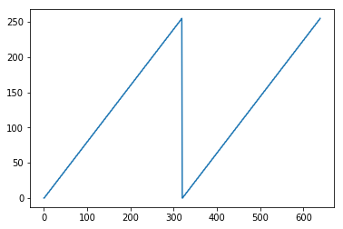
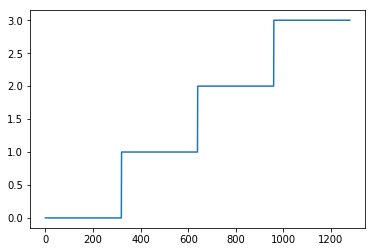
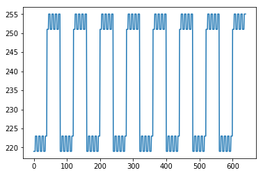

# Analyzing the contents of DX

In the program, a couple of the effects use the `DX` register. This register is basically the high word of the multiplication of the `DI` and the 'magic' number `0xcccd`. To understand why the author uses this number we need to dig a bit into this bit of code:

```
    mov    ax, 0xcccd
    mul    di
```

Remember that `DI` is basically a counter. When you multiply `DI` (a 16 bit number) with `0xcccd` (another 16 bit numbre) you get a 32 bit number. The high part is stored in `DX` and the lower part in `AX`. If you look at the code you'll see that the `AX` number is discarded so lets focus on `DX`. Lets look at how it behaves as a function of `DI`. For this let's do couple of simple graphs. Lets import the pyplot library:


```python
import matplotlib.pyplot as plt
```

and set up two arrays to hold the top (`DH`) and bottom registers (`DL`) part of `DX`


```python
result_dh = []
result_dl = []
```

Lets loop through the first **n** bytes of DI and calculate `DX`


```python
n = 0xffff;
for di in range(0, n, 1):

    # mov ax, 0xcccd
    # mul di
    m = di * 0xcccd
    dx = (m & 0xffff0000) >> 16
    dx = dx & 0xffff
    ax = (m & 0xffff)
    
    result_dl.append(dx & 0xff)
    result_dh.append((dx & 0xff00) >> 8)
```

Now lets plot the low and high bytes of `DX` as a function of `DI`


```python
offset = 0
plt.plot(result_dl[offset:offset+640])
plt.show()
```





```python
plt.plot(result_dh[offset:offset+640*2])
plt.show()
```





So we see two important properties:

1. Both functions have a period of **320** which is the width of the screen.
2. In the case of `DL` we see its a sawtooth with period 320.
3. In the case of `DH` we see that its an increasing function which basically adds 1 after 320 bytes.

These properties of `DX` will be used for some of the effects in the demo.


```python
offset = 0
result_dl_xor_dh = map(lambda dh, dl: (dh^dl) | 0xdb, result_dh, result_dl)
plt.plot(result_dl_xor_dh[offset:offset+320 * 2])
plt.show()
```




