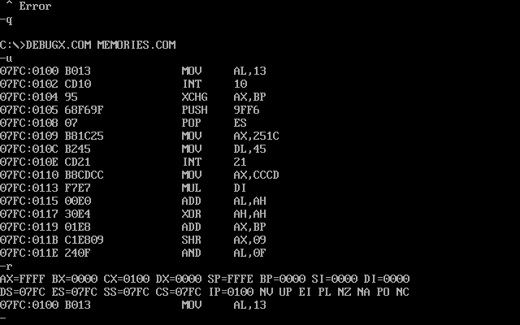

## Revision2020 Notes - "Memories" - 256 byte MSDOS intro

It's that time of the year again: **Revision 2020 party**. This weekend (Easter weekend) the Coronavirus has forced the demo party to be remote which means we get to experience it. In here I'll drop my notes and links to stuff I find interesting.

The first demo that caught my eyes is [this one](https://www.youtube.com/watch?v=Imquk_3oFf4). Its a 256 **byte** demo. I always find it amazing this can be done so I want to try to understand some of the trick used here. Fortunately this time the entry ([you can downoad it here](https://www.pouet.net/prod.php?which=85227)) comes with the source code! To run it (in Linux, of course) all you need is to install `dosbox` (and `nasm` if you want to compile the code) with:

 `$ sudo apt-get install dosbox nasm`

 unzip it in a directory and run it with:

 `dosbox -conf dosbox-0.74-3.conf memories.com`

to compile do:

  `nasm memories-dosbox.asm -fbin -o test.com`

This will work fine without audio (at least in my case there is no audio. I'll see how to set it up a bit later)

I'll write more notes here as I dive into the code. First some reminder of the registers in the 8086/80256 to understand a bit the listing:


*TODO* Either add credits or change to a table

### Notes

- To look at the status of registers and debug the app you can run DEBUGX with Dosbox with: 
  
  ```
  $ dosbox -conf dosbox-0.74-3.conf DEBUGX.COM
  ```



### Links 🔗

- [Memories 256b demo](https://www.pouet.net/prod.php?which=85227) - Entry in Pouet.
- [YouTube Video of demo running](https://www.youtube.com/watch?v=Imquk_3oFf4) - Video where can see the demo running
- [The list of all interrupts that are currently supported by the 8086 assembler emulator](http://www.ablmcc.edu.hk/~scy/CIT/8086_bios_and_dos_interrupts.htm)
- [Intro and resources to 8086 assembly]([Introduction to x86 Assembly Language](http://www.c-jump.com/CIS77/ASM/Assembly/lecture.html)) - lecture notes from course [CIS-77 Introduction to Computer Systems](http://www.c-jump.com/CIS77/CIS77syllabus.htm) 
- [Modes of Memory Addressing on x86](http://www.c-jump.com/CIS77/ASM/Memory/lecture.html) - lecture notes from same course as above
- [MS-DOS DEBUG Program](https://thestarman.pcministry.com/asm/debug/debug.htm)
- [MS-DOS Github repo with source code](https://github.com/microsoft/MS-DOS)
  
