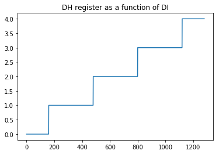

# Analysis of Revision'2020 PC 256 byte intro winner "Memories" by HellMood / DESiRE

It's that time of the year again: **Revision 2020 party**. This weekend (Easter weekend) the Coronavirus has forced the demo party to be remote which means we get to experience it as a first class citizen from the other end of the world. One of my favorite categories is the **PC 256 byte intro**. I'm always amazed at what smart people can accomplish with limited resources. This year's winner is, in my opinion incredible so I though I needed to have a deep look into how this is done. 

(@TODO: Talk a little more about the winner entry)

[Entry in Pouet](https://www.pouet.net/prod.php?which=85227)


The result of my investigations is this article. It's quite long and is a work in progress. Even though the main idea of the code is easy to grasp each effect is its own world and the code is full of substelties.

## Pre-requisites

This article might interest people who want to understand a little how these tiny demos/intros work. What's great is that you need very little to be able to play with the code. You need to install two tools: **dosbox** (recommended version 0.74) and **nasm**.

I'm on Linux but you can deduce how to do the same in Windoze/MacOS. Install  **dosbox** and **nasm** with:

`$ sudo apt-get install dosbox nasm`

Once you have installed both tools you can watch the demo with

`dosbox -conf dosbox-0.74-3.conf memories.com`

To compile the demo just run:

`nasm memories.asm -fbin -o memories.com`

Just for reference here's an animated GIF with the 8 effects:


You can also watch the [video in YouTube](https://www.youtube.com/watch?v=Imquk_3oFf4).

To undestand the code you'll need:

- *Some knowledge of 8086 assembly* (or similar). In Appendix NN I've included the main registers of the 8086 and some links so that you can learn a bit more.
- *Some knowledge of the 8086 architecture* You need to know what segments are and how DOS interrupts work. Fortunately you don't need to know too much to understand most of the code so don't worry too much.
- *VGA mode 13h*  Even though VGA modes are pretty tricky, fortunately for us this demo uses whats known as mode 13h (see Appendinx NN) which is pretty straightforward.
- *Jupyter notebook* To understand parts of this demo I used a Jupyter notebook to explore a little the functions that the demos uses. If you have experience you can play and tweak it.

## Main idea of the Algorithm

So, the structure of the demo is the following: after a short initialization of the registers, video mode and timer interrupt we have the main loop of the intro which goes over all pixels of the 320x200 screen continously. For each pixel an effect routine is called which returns the color it should be painterd. This is the same way in which shaders work so in a sense each effect is a 'mini-shader'. The effect routine which is picked for the current pixel varies with time. Initially it uses one 'shader' and as time passes it start to mix pixels from the current shader and the next until all pixels start coming from the next shader. This is how the current shaders and the next are blended. You can see this clearly in the demo. The process repeats until the last effect is displayed. Simple! Right? Weeeell... so yeah, that's the main idea and its pretty straightforward to understand. But, as they say, the devil is in the details.

To understand the main idea lets go over a simplified version of the demo code. I've removed all sound related code to make things a bit easier to follow. Here's the simplified version with more comments:

```
  1 org 100h                ; program is loaded at 0x0100
  2 s:
  3     mov al, 0x13        ; 320x200, 256 color 1 page graphics 0x13
  4     int 0x10            ; int 10h. Assumes AH = 0x00
  5 
  6     xchg bp, ax         ; load BP (0x0000 at start) into AX
  7                         ; (efectively clearing it) (BP = 0x0013)
  8     push 0xa000-10      ; 0xA000:0000 is the begging of VGA Memory
  9     pop  es             ; ES = 0x9FF6 (0xA000 - 0x10)
 10 
 11     mov ax, 0x251c
 12     mov dl, timer       ; assume DH=1, mostly true on DosBox
 13     int 0x21            ; AX = 0x251c , DX = 0x0145 (org 0x100 + offset to
 14                         ; timer function):
 15 
 16 ; ------------------------------------------------------------------------------
 17 ; Main loop and initial values of key registers.
 18 ; DI has 0x0000 and has the offset into VGA RAM
 19 ; BP has 0x0013 and is our 'time' variable updated in our interrupt callback.
 20 ; ES starts with 0xA000 - 0x10 (0x9FF6) points to the start segment of VGA
 21 ; ------------------------------------------------------------------------------
 22 
 23 top:
 24 
 25     mov ax,0xcccd
 26     mul di
 27 
 28     ; Choose which effect to play next. The value is stored in AL and is
 29     ; an index to the 'table:' entry list. This code is responsible
 30     ; of the fading in / out of effects. It's a function of the
 31     ; DI and BP registers.
 32     add al,ah
 33     xor ah,ah
 34     add ax,bp
 35     shr ax,9
 36     and al,15
 37 
 38     xchg bx, ax
 39     mov bh, 1               ; Load offset to effect to BX
 40     mov bl, [byte bx+table]
 41     call bx                 ; Call effect
 42 
 43     stosb                   ; Store pixel color AL -> ES:[DI++]
 44     inc di
 45     inc di
 46     jnz top
 47 
 48     ; Do some weird shit with I/O ports....
 49     mov al,tempo
 50     out 40h,al              ; This is the 'counter divisor'. It controlls
 51                             ; how often the interrupt fires.
 52 
 53     in al,0x60              ; Read from scan-code from keyboard.
 54 
 55     dec al                  ; Compare the keycode with 1 (ESC key)
 56     jnz top
 57 
 58     ret                     ; exit
 59 
 60 ; Table of offsets to effects -----------------------------------
 61 table:
 62     db fx2-s,fx1-s,fx0-s,fx3-s,fx4-s,fx5-s,fx6-s,sounds-s,stop-s
 63 stop:
 64     pop ax
 65     ret
 66 
 67 timer:
 68     inc bp
 69     iret
 70 
 71 fx0:
 72     ...
 73 ret
 74 
 75 fx1:
 76     ...
 77 ret
```

Let's dive into the details.

### Lines 1 - 13: initialization

This code is pretty straightforward:

- **lines 3-4** tell the computer to switch to VGA mode 0x13 (13h) which is a video mode with resoltion 320x200 and 256 colors. In this mode the color for each pixel on the screen is specified by a single byte in video ram which starts at [0xA000:0000]. See Appendix NN for more details. To avoid using 2 bytes this code assumes that the high part of `AX` (`AH`) is zero which is the case when the program starts.
- **line 6** initialized `BP` with 0x13. We'll see why later (note: if I figure out why its needed :-) )
- **lines 8-9** Load the extra segment to the start of the VGA memory (0xA000) minus 0x10 (we'll see why. If I can figure it out :-) )
- **lines 11-13** setup the timer routine. This basically tells the computer to call the function `timer:` every so often. This is the function that basically increases our 'time' variable (the `BP` register) and also plays the next sound (not included in code for now).

### Lines 14 - 58: main loop

This code is the main part of the demo and gets looped continously to calculate the color of each pixel. To undestand it a little you need to keep in mind the initial values of some of the registers that are preserved throught the code. These are:

- **`DI`** this is the offset into VGA RAM. When `DI` is zero its at the top left pixel of the screen. When `DI` is 319 its at the top right pixel and so on. `DI` basically goes from 0 - 0xFFFF continously.
- **`BP`** this is a 'time' variable that is increased every time the timer function is called. This register is used by the shaders to change  with time. We'll see more later.
- **`ES`** the extra segment is fixed at `0xA000` which is the start segment of the VGA RAM. Not modified again.

Now lets have a look at this code a bit. Now we have some pretty sneaky code here.

- **lines 25-26** This code is pretty important and it took me a while to figure what it was doing. This code simply takes the content of `DI` (the current pixel we are looking at) and multiplies it by the magic number `0xcccd`. Since we are multiplying two 16 bit number the result is a 32 bit number which is stored in `DX:AX`. The low 16 bits will be overriden in the next lines so let's forget about it. But the value of `DX` **is** used on some of the shaders and its important to understand what it stores. This took me a night to figure out but I think I have a better idea. Have a look at Appendix NN to see how its calculated.
- **lines 28-36** This code takes the low 16 bits of the previous multiplication and does some magic to it. See Appendix NN to understand the details but the end result is that the low 8 bits of `AX` (`AL`) has a number between 0 - 0xF. If you think of this as a function of `DI` it basically has an almost fixed number for a while and as the `DI` increases it starts oscillating between that value and the next until it finally settles to the next value. This is used to switch between shaders. So, the sequence looks something like this (as a function of time): 

`0 0 0 0 0 ... 0 0 1 0 0 1 0 0 1 0 0 ... 1 1 1 0 1 1 1 0 1  ... 1 1 1 1 1 1 ... 1 1 1 1 2 1 ...` 
- **lines 38 - 46** This code basically takes the value of `AL` and uses its value to in the `BX` register. The value of `AL` is basically an offset into the array of shaders stored in lines 61-62. Once we have in `BX` the address of the 'shader' responsible for calculating the color of the current pixel line 41 calls it and lines 43-46 store the pixel on the screen, increas DI by 3 (not sure why we need it to be 3. As long as its odd the result is the same. I bet this is related to the sound part of the code which I have ommited.)
- **lines 48 - 58** This code sets the 'counter divisor' to make the interrupt trigger more often (quicker) or slower. 
- **lines 53 - 58** poll the keyboard and if the user hits ESC exits otherwise it goex back to `top:` and the continues.

## Lines 61-70: Misc code 

- **lines 61-62** hold the offsets to each of the shader functions and the final 'stop' routine which exists the demo once it finishes calling all shaders. This same offset seem to be used for the sound but I'm ignoring all that for now.
- **lines 63-66** is the exit code of the intro
- **lines 67-70** this is the interrupt handler for the timer. This gets called many times per second (dependent on the value of the `tempo` variable). In our simplified version this increases the value of `BP` (time) and returns. In the full demo this part of the code takes care of the music.

OK, great! That was easy! Right? Well ... it took a while to figure out but the fun is just starting. Now lets dive into each individual shader.

## Board of chessboards

This is the first effect to display (in the code its labelled as `fx2`). To understand the way effects works and not have to worry about the rest I've made a simpler version of the demo that only plays one effect. You should now understand most of the code in there and we can focus on only the effect. You can play with it: it's the file called `fx2.asm`. To compile it you can do:

`nasm fx2.asm -fbin -o fx2.com`

and run it in the same way as you ran the intro:

`dosbox -conf dosbox-0.74-3.conf fx2.com`

This is what you should see when you run it:


The resulting code is 51 bytes! Let's take a look at `fx2.asm`:

```
  1 %define targetFPS               65
  2 %define tempo                   1193182/256/targetFPS 
  3 
  4 org 100h
  5 s:
  6     mov al, 0x13        ; initialization code
  7     int 0x10
  8     push 0xa000-10 
  9     pop  es
 10     mov ax, 0x251c
 11     mov dl, timer
 12     int 0x21  
 13 
 14 top: 
 15     mov ax, 0xcccd
 16     mul di              ; di * 0xcccd -> dx:ax
 17 
 18     ; Call effect
 19     call fx2
 20 
 21     ; Store AL register in ES:[DI] and increase DI.
 22     stosb
 23     inc di
 24     inc di
 25     jnz top
 26 
 27 ; setup frequency of timer
 28     mov al, tempo
 29     out 40h, al
 30 
 31 ; read a character from keyboard into AL
 32     in al,0x60
 33 
 34 ; return to top of loop if AL != 1
 35     dec al
 36     jnz top
 37 
 38     ret
 39 
 40 timer:
 41     inc bp
 42     iret
 43 
 44 ;
 45 ; Chessboard effect
 46 ;
 47 fx2:
 48     xchg dx,ax
 49     sub ax,bp
 50     xor al,ah
 51     or al,0xDB      ; limit to 4 posibble colors
 52     add al,13h
 53 ret
```

To simplify the code I've removed all other effects and constants, and also the belding of effects code. You should understand everything that is happening here from my previous explenation so now we can focus on **lines 47 - 53** that are the 'meat' of the shader. Let's see how they work.

For starters lets look at the last two lines (**51-52**). If you look at the binary representation of `0xDB` you get this: `1101 1011`. When you perform the `OR` function of **any** 8 bit number with this you can only get 4 possible values: `1101 1011`, `1101 1111`, `1111 1011` or `1111 1111`. In Hex that would be: `0xDB`, `0xDF`, `0xFB` or `0xFF`. Now if we add `0x13` to this numbers you can only get the following four numbers: `0xEE`, `0xF2`, `0x0E` and `0x12`. So, the first conclusion is this shader can return 4 possible colors and if we look at the color chart in Apendix NN you'll see that they are: a dark color 1 (`0xEE`), black (`0xF2`), a bright yellow (`0x0E`) and dark color 2 (`0xF2`). If you look at the closeup this can be clearly seen:


So, that leaves us with only 3 lines! We're close. If you comment **line 49** and run the code you'll see the chessboard patter but it won't move. That's because if you remember `BP` register has the 'time'. So this basically displaces the whole pattern. So, we can ignore ir for now. All the magic happens in lines **48** and **50**.

## Appendix 1: the 8086 and its architecture

I'll write more notes here as I dive into the code. First some reminder of the registers in the 8086/80256 to understand a bit the listing:


*TODO* Either add credits or change to a table

### Some links 🔗

- [YouTube Video of demo running](https://www.youtube.com/watch?v=Imquk_3oFf4) - Video where can see the demo running
- [The list of all interrupts that are currently supported by the 8086 assembler emulator](http://www.ablmcc.edu.hk/~scy/CIT/8086_bios_and_dos_interrupts.htm)
- [Intro and resources to 8086 assembly]([Introduction to x86 Assembly Language](http://www.c-jump.com/CIS77/ASM/Assembly/lecture.html)) - lecture notes from course [CIS-77 Introduction to Computer Systems](http://www.c-jump.com/CIS77/CIS77syllabus.htm) 
- [Modes of Memory Addressing on x86](http://www.c-jump.com/CIS77/ASM/Memory/lecture.html) - lecture notes from same course as above
- [MS-DOS DEBUG Program](https://thestarman.pcministry.com/asm/debug/debug.htm)
- [MS-DOS Github repo with source code](https://github.com/microsoft/MS-DOS)
  

## Appendix 2: VGA mode 13h


For some of the things I needed the RGB colors of all 256 colors. Since I couldn't find them I wrote a little `PHP` code to go over the image and extract them to RGB values. You can see [the code in this gist](https://gist.github.com/cesarmiquel/1780ab6078b9735371d1f10a9d60d233) and download a CSV file with them.

## Apendix 3: Jupyter notebook

To understand a lot of what goes on in the demo I created a [Jupyter notebook](https://jupyter.org/) which i'm including here as an appendix. You can download the notebook [here](memories-notes.ipynb) if you want to play arround with it. To use in Linux just go to this directory and do:

```
$ pip install notebook
$ pip install matplotlib
$ jupyter notebook
```

And open the file `Memories-notes.ipynb` by clicking on it in the browser window. If you just want to see it here's the markdown version:


# Analyzing the contents of DX

In the program, a couple of the effects use the `DX` register. This register is basically the high word of the multiplication of the `DI` and the 'magic' number `0xcccd`. To understand why the author uses this number we need to dig a bit into this bit of code:

```
    mov    ax, 0xcccd
    mul    di
```

Remember that `DI` is basically a counter. When you multiply `DI` (a 16 bit number) with `0xcccd` (another 16 bit numbre) you get a 32 bit number. The high part is stored in `DX` and the lower part in `AX`. If you look at the code you'll see that the `AX` number is discarded so lets focus on `DX`. Lets look at how it behaves as a function of `DI`. For this let's do couple of simple graphs. Lets import the pyplot library:


```python
import matplotlib.pyplot as plt
```

and set up two arrays to hold the top (`DH`) and bottom registers (`DL`) part of `DX`


```python
result_dh = []
result_dl = []
```

Lets loop through the first **n** bytes of DI and calculate `DX`


```python
n = 0xffff;
for di in range(0, n, 1):

    # mov ax, 0xcccd
    # mul di
    m = di * 0xcccd
    dx = (m & 0xffff0000) >> 16
    dx = dx & 0xffff
    ax = (m & 0xffff)
    
    result_dl.append(dx & 0xff)
    result_dh.append((dx & 0xff00) >> 8)
```

Now lets plot the low and high bytes of `DX` as a function of `DI`


```python
offset = 0
plt.plot(result_dl[offset:offset+640])
plt.show()
```


```python
plt.plot(result_dh[offset:offset+640*2])
plt.show()
```





So we see two important properties:

1. Both functions have a period of **320** which is the width of the screen.
2. In the case of `DL` we see its a sawtooth with period 320.
3. In the case of `DH` we see that its an increasing function which basically adds 1 after 320 bytes.

These properties of `DX` will be used for some of the effects in the demo.


```python
offset = 0
result_dl_xor_dh = map(lambda dh, dl: (dh^dl) | 0xdb, result_dh, result_dl)
plt.plot(result_dl_xor_dh[offset:offset+320 * 2])
plt.show()
```


