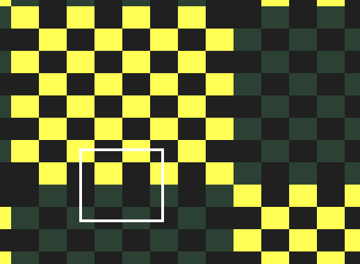

# Analysis of Revision'2020 PC 256 byte intro winner "Memories" by HellMood / DESiRE

**Update** Hellmood has be kind enough to just release [this long article on the demo](http://sizecoding.org/wiki/Memories). Still this article may have some value and it is a lot of fun write to nail down the little details. 4/20/20

**20 April 2020**

It's that time of the year again: **Revision 2020 party**. The past weekend (Easter weekend) the Coronavirus has forced the demo party to be remote which meant we get to experience it as a first class citizen from the other end of the world (Argentina 🇦🇷). One of my favorite categories is the **PC 256 byte intro**. I'm always amazed at what smart people can accomplish with limited resources. This year's winner is, in my opinion incredible so I though I needed to have a deep look into how it worked. 

The intro is called *"Memories"* and you can find it here: [Pouet](https://www.pouet.net/prod.php?which=85227). You can also watch the [video in YouTube](https://www.youtube.com/watch?v=Imquk_3oFf4). If you download the code you'll notice that the author was kind enough to provide the source code! This is really important and great in my opinion because it allows people to study it and learn from it. Surprisingly this doesn't seem to be the norm although I see that more and more people are releasing their source code or at least the shaders are shared via [ShaderToy](https://www.shadertoy.com/).

The result of my investigations is this article. It's quite long and is a work in progress. Even though the main idea of the code is easy to grasp each effect is its own world and the code is full of subtelties. 

## Pre-requisites

This article might interest people who want to understand a little how these tiny demos/intros work. What's great is that you need very little to be able to play with this particular demo. You need to install two tools: **Dosbox** (recommended version 0.74) and **NASM**.

I'm on Linux but you can deduce how to do the same in Windoze/MacOS. Install  **Dosbox** and **NASM** with:

`$ sudo apt-get install dosbox nasm`

Once you have installed both tools you can watch the demo with

`dosbox -conf dosbox-0.74-3.conf memories.com`

To compile the demo just run:

`nasm memories.asm -fbin -o memories.com`

Just for reference here's an animated GIF with the 8 effects:

<p align="center">
  </img>
</p>

You can also watch the [video in YouTube](https://www.youtube.com/watch?v=Imquk_3oFf4).

To undestand the code you'll need:

- *Some knowledge of 8086 assembly* (or similar). In Appendix 1 I've included the main registers of the 8086 and some links so that you can learn a bit more.
- *Some knowledge of the 8086 architecture* You need to know what segments are and how DOS interrupts work. Fortunately you don't need to know too much to understand most of the code so don't worry too much.
- *VGA mode 13h*  Even though VGA modes are pretty tricky, fortunately for us this demo uses whats known as mode 13h (see Appendinx 2) which is pretty straightforward.
- *Jupyter notebook* To understand parts of this demo I used a Jupyter notebook to explore a little the functions that the demos uses. If you have experience you can play and tweak it.

## Main idea of the Algorithm

So, the structure of the demo is the following: after a short initialization of the registers, video mode and timer interrupt we have the main loop of the intro which goes over all pixels of the 320x200 screen continuously. For each pixel an effect routine is called which returns the color it should be painted. This is the same way in which shaders work so in a sense each effect is a 'mini-shader'. The effect routine which is picked for the current pixel varies with time. Initially it uses one 'shader' and as time passes it start to mix pixels from the current shader and the next until all pixels start coming from the next shader. This is how the current shaders and the next are blended. You can see this clearly in the demo. The process repeats until the last effect is displayed. Simple! Right? Weeeell... so yeah, that's the main idea and its pretty straightforward to understand. But, as they say, the devil is in the details.

To understand the main idea lets go over a simplified version of the demo code. I've removed all sound related code to make things a bit easier to follow. Here's the simplified version with more comments:

```
  1 org 100h                ; program is loaded at 0x0100
  2 s:
  3     mov al, 0x13        ; 320x200, 256 color 1 page graphics 0x13
  4     int 0x10            ; int 10h. Assumes AH = 0x00
  5 
  6     xchg bp, ax         ; load BP (0x0000 at start) into AX
  7                         ; (efectively clearing it) (BP = 0x0013)
  8     push 0xa000-10      ; 0xA000:0000 is the begging of VGA Memory
  9     pop  es             ; ES = 0x9FF6 (0xA000 - 0x10)
 10 
 11     mov ax, 0x251c
 12     mov dl, timer       ; assume DH=1, mostly true on DosBox
 13     int 0x21            ; AX = 0x251c , DX = 0x0145 (org 0x100 + offset to
 14                         ; timer function):
 15 
 16 ; ------------------------------------------------------------------------------
 17 ; Main loop and initial values of key registers.
 18 ; DI has 0x0000 and has the offset into VGA RAM
 19 ; BP has 0x0013 and is our 'time' variable updated in our interrupt callback.
 20 ; ES starts with 0xA000 - 0x10 (0x9FF6) points to the start segment of VGA
 21 ; ------------------------------------------------------------------------------
 22 
 23 top:
 24 
 25     mov ax,0xcccd
 26     mul di
 27 
 28     ; Choose which effect to play next. The value is stored in AL and is
 29     ; an index to the 'table:' entry list. This code is responsible
 30     ; of the fading in / out of effects. It's a function of the
 31     ; DI and BP registers.
 32     add al,ah
 33     xor ah,ah
 34     add ax,bp
 35     shr ax,9
 36     and al,15
 37 
 38     xchg bx, ax
 39     mov bh, 1               ; Load offset to effect to BX
 40     mov bl, [byte bx+table]
 41     call bx                 ; Call effect
 42 
 43     stosb                   ; Store pixel color AL -> ES:[DI++]
 44     inc di
 45     inc di
 46     jnz top
 47 
 48     ; Set frequency for the timer interrupt routine
 49     mov al,tempo
 50     out 40h,al              ; This is the 'counter divisor'. It controls
 51                             ; how often the interrupt fires.
 52 
 53     in al,0x60              ; Read from scan-code from keyboard.
 54 
 55     dec al                  ; Compare the keycode with 1 (ESC key)
 56     jnz top
 57 
 58     ret                     ; exit
 59 
 60 ; Table of offsets to effects -----------------------------------
 61 table:
 62     db fx2-s,fx1-s,fx0-s,fx3-s,fx4-s,fx5-s,fx6-s,sounds-s,stop-s
 63 stop:
 64     pop ax
 65     ret
 66 
 67 timer:
 68     inc bp
 69     iret
 70 
 71 fx0:
 72     ...
 73 ret
 74 
 75 fx1:
 76     ...
 77 ret
```

Let's dive into the details.

### Lines 1 - 13: initialization

This code is pretty straightforward:

- **lines 3-4** tell the computer to switch to VGA mode 0x13 (13h) which is a video mode with resoltion 320x200 and 256 colors. In this mode the color for each pixel on the screen is specified by a single byte in video ram which starts at [0xA000:0000]. See Appendix 2 for more details. To avoid using 2 bytes this code assumes that the high part of `AX` (`AH`) is zero which is the case when the program starts.
- **line 6** initialized `BP` with 0x13. We'll see why later. (@TODO)
- **lines 8-9** Load the extra segment to the start of the VGA memory (0xA000) minus 0x10 (we'll see why. (@TODO)
- **lines 11-13** setup the timer routine. This basically tells the computer to call the function `timer:` every so often. This is the function that basically increases our 'time' variable (the `BP` register) and also plays the next sound (not included in code for now).

### Lines 14 - 58: main loop

This code is the main part of the demo and gets looped continuously to calculate the color of each pixel. To undestand it a little you need to keep in mind the initial values of some of the registers that are preserved throught the code. These are:

- **`DI`** this is the offset into VGA RAM. When `DI` is zero its at the top left pixel of the screen. When `DI` is 319 its at the top right pixel and so on. `DI` basically goes from 0 - 0xFFFF continuously.
- **`BP`** this is a 'time' variable that is increased every time the timer function is called. This register is used by the shaders to change  with time. We'll see more later.
- **`ES`** the extra segment is fixed at `0xA000` which is the start segment of the VGA RAM. Not modified again.

Now lets have a look at this code a bit. Now we have some pretty subtle code here.

- **lines 25-26** This code is pretty important and it took me a while to figure what it was doing. These two lines simply takes the content of `DI` (the offset to the current pixel we are looking at) and multiplies it by the 'magic' number `0xCCCD`. Since we are multiplying two 16 bit number the result is a 32 bit number which is stored in `DX:AX`. The low 16 bits will be overriden in the next lines so let's forget about it. But the value of `DX` **is** used by the shaders and it's important to understand what it stores. This took me a night to figure out but I think I have a better idea. Have a look at Appendix 3 to see how it's calculated.
- **lines 28-36** This code takes the low 16 bits of the previous multiplication and does some magic to it. See Appendix 3 to understand the details but the end result is that the low 8 bits of `AX` (`AL`) has a number between 0 - 0xF. If you think of this as a function of `DI` it basically has an almost fixed number for a while and as the `DI` increases it starts oscillating between that value and the next until it finally settles to the next value. This is used to switch between shaders. So, the sequence looks something like this (as a function of time): 

`0 0 0 0 0 ... 0 0 1 0 0 1 0 0 1 0 0 ... 1 1 1 0 1 1 1 0 1  ... 1 1 1 1 1 1 ... 1 1 1 1 2 1 ...` 

- **lines 38 - 46** The register `AX` is copied onto `BX` and will be used as the location of the shader to call for the curren pixel. The value of `AL` is basically an offset into the array of shaders stored in lines 61-62. Once we have in `BX` the address of the 'shader' responsible for calculating the color of the current pixel line 41 calls it and lines 43-46 store the pixel on the screen, increase DI by 3 (not sure why we need it to be 3. As long as its odd the result is the same.)
- **lines 48 - 58** This code sets the 'counter divisor' to make the interrupt trigger more often (quicker) or slower. 
- **lines 53 - 58** poll the keyboard and if the user hits ESC exits otherwise it goes back to `top:` and the continues.

## Lines 61-70: Misc code 

- **lines 61-62** hold the offsets to each of the shader functions and the final 'stop' routine which exists the demo once it finishes calling all shaders. This same offset seem to be used for the sound but I'm ignoring all that for now.
- **lines 63-66** is the exit code of the intro
- **lines 67-70** this is the interrupt handler for the timer. This gets called many times per second (dependent on the value of the `tempo` variable). In our simplified version this increases the value of `BP` (time) and returns. In the full demo this part of the code takes care of the music.

OK, great! That was easy! Right? Well ... it took a while to figure out but the fun is just starting. Now lets dive into each individual shader.

## Effect: Board of chessboards

This is the first effect to display (in the code its labelled as `fx2`). To understand the way effects works and not have to worry about the rest I've made a simpler version of the demo that only plays one effect. You should now understand most of the code in there and we can focus on only the effect. You can play with it: it's the file called `fx2.asm`. To compile it you can do:

`nasm fx2.asm -fbin -o fx2.com`

and run it in the same way as you ran the intro:

`dosbox -conf dosbox-0.74-3.conf fx2.com`

This is what you should see when you run it:

<p align="center">
  </img>
</p>

The resulting code is 51 bytes! Let's take a look at `fx2.asm`:

```
  1 %define targetFPS               65
  2 %define tempo                   1193182/256/targetFPS 
  3 
  4 org 100h
  5 s:
  6     mov al, 0x13        ; initialization code
  7     int 0x10
  8     push 0xa000-10 
  9     pop  es
 10     mov ax, 0x251c
 11     mov dl, timer
 12     int 0x21  
 13 
 14 top: 
 15     mov ax, 0xcccd
 16     mul di              ; di * 0xcccd -> dx:ax
 17 
 18     ; Call effect
 19     call fx2
 20 
 21     ; Store AL register in ES:[DI] and increase DI.
 22     stosb
 23     inc di
 24     inc di
 25     jnz top
 26 
 27 ; setup frequency of timer
 28     mov al, tempo
 29     out 40h, al
 30 
 31 ; read a character from keyboard into AL
 32     in al,0x60
 33 
 34 ; return to top of loop if AL != 1
 35     dec al
 36     jnz top
 37 
 38     ret
 39 
 40 timer:
 41     inc bp
 42     iret
 43 
 44 ;
 45 ; Chessboard effect
 46 ;
 47 fx2:
 48     xchg dx,ax
 49     sub ax,bp
 50     xor al,ah
 51     or al,0xDB      ; limit to 4 posibble colors
 52     add al,13h
 53 ret
```

To simplify the code I've removed all other effects and constants, and also the blending of effects code. You should understand everything that is happening here from my previous explanation so now we can focus on **lines 47 - 53** that are the 'meat' of the shader. Let's see how they work.

For starters lets look at the last two lines (**51-52**). If you look at the binary representation of `0xDB` you get this: `1101 1011`. When you perform the `OR` function of **any** 8 bit number with this you can only get 4 possible values: `1101 1011`, `1101 1111`, `1111 1011` or `1111 1111`. In Hex that would be: `0xDB`, `0xDF`, `0xFB` or `0xFF`. Now if we add `0x13` to this numbers you can only get the following four numbers: `0xEE`, `0xF2`, `0x0E` and `0x12`. So, the first conclusion is this shader can return 4 possible colors and if we look at the color chart in Apendix 2 you'll see that they are: a dark color 1 (`0xEE`), black (`0xF2`), a bright yellow (`0x0E`) and dark color 2 (`0xF2`). If you look at the closeup this can be seen (although the two dark colors are very close to each other so I've tweaked a little the colors of the image so you can see it):

<p align="center">
  </img>
</p>

So, that leaves us with only 3 lines! We're close. **Line 48** simply exchanges the value of `DX` and `AX`. Since at the top of the loop `DX` is calculated again it doesn't matter that it gets overriden by `AX`. So now the value that was calculted at the beginning of the loop is in `AX`. If you comment **line 49** and run the code you'll see the chessboard pattern but it won't move. That's because if you remember `BP` register has the 'time'. So substracting `BP` from `AX` basically shifts the whole pattern. So, we can ignore it for now. All the magic happens in line **50** which modifies what's in the accumulator (`AX`).

So, as I mentioned in the previous section, the value of `DX` is special. The register's high byte (`DH`) has the y coordinate of the pixel we are looking at and the low byte (`DL`) has the equivalent of the *x* coordinate. The only difference is that instead of beeing going from 0 - 319 it goes from 0 - 255. You can take a look at the Jupyter notebook in Appendix 3 to understand this in more detail. So now we need to understand what happens when we **XOR** these two numbers. To try to understand how it works you can do all possible XOR of the first nibble (4 bits). So we can create an XOR table.


This table might look a bit confusing at first but it's not so complicated. At the top we see the numbers from 0 - 15 (0x0 - 0xf). The same thing with the rows. At the intersection of the two numbers you also see number which is the result of doing the **XOR** between the row and the column number. This function is symetric across the diagonal since `A XOR B` is the same as `B XOR A`. Also at the intersection you can see a small bar with white/red pixes. That is basically the binary representation of the number. So, let's do an example: let's do `0x4 XOR 0x9`. If we look at the table the interesction of row 4 and column 9 shows 13 (`0xD`) which has binary representation `1101`.
Finally there are 4 graphs below that should look familiar! The first graph shows the value of the first bit for each table. The second graph, the second, and so on. So, continuing with the example `0x4 XOR 0x9` we see that since the result in binary is `1101` then the intersection of row 4 with col 9 (an row 9, col 4) of the first, second and last graph will be red wheras it will be white for the third graph (3rd bit). You can explore this in the Jupyter notebook I include in the repo (and reproduce in Appendix 3)

Let's see how all this works together. We'll look with a little detail how the first row of pixels is rendered. To simplify a little more the analysis we'll set `BP=0`. During the first row er have: `DI = 0, 1, ... 319`, `DH = 0, 0, ... 0`, `DL = 0, 0, 1, 2, 3, 4, 4, 5, 6, 7, 8, 8, 9, 10, ..., 253, 254, 255`. So, we need to look at this:

```
 48     xchg dx,ax
 49     sub ax,bp
 50     xor al,ah
 51     or al,0xDB      ; 0xDB = 1101 1011
 52     add al,13h
```

We can ignore **line 49** (`BP=0`). What determines which of the 4 colors we get for each pixel are the 2nd bit of the high nibble of `AL XOR AH` and the 3rd bit of the low nibble of the *XOR*. By looking at the 'XOR' table and the patterns we see that those bits will mix the second and third graphs. You'll probably need to go through it manually or play around with the Jupyter notebook I've provided.

## Effect: Circles Zooming

```
  1 %define circles_pattern 8+16
  2
  3 fx1:
  4 	mov al, dh
  5 	sub al, 100
  6 	imul al
  7 	xchg dx, ax
  8 	imul al
  9 	add dh, ah
 10 	mov al, dh
 11 	add ax, bp
 12 	and al, circles_pattern
ret
```

Pending.

## Effect: Tilted plane scrolling

```
  1 fx0: ; tilted plane, scrolling
  2 	mov ax,0x1329
  3 	add dh,al
  4 	div dh
  5 	xchg dx,ax
  6 	imul dl
  7 	sub dx,bp
  8 	xor ah,dl
  9 	mov al,ah
 10 	and al,tilt_plate_pattern
 11 ret

```
Pending.

## Effect: Parallax checkerboards

```
  1 fx3: ; parallax checkerboards
  2 	mov cx,bp
  3 	mov bx,-16
  4 fx3L:
  5 	add cx,di
  6 	mov ax,819
  7 	imul cx	 
  8 	ror dx,1	 
  9 	inc bx	 
 10 	ja fx3L
 11 	lea ax,[bx+31]	 
 12 ret
```
Pending.

## Effect: Sierpinski rotozoomer

```
  1 fx4: ; sierpinski rotozoomer	
  2 	lea cx,[bp-2048]
  3     sal cx,3
  4 	movzx ax,dh
  5 	movsx dx,dl
  6 	mov bx,ax
  7 	imul bx,cx
  8 	add bh,dl
  9 	imul dx,cx
 10 	sub al,dh
 11 	and al,bh
 12 	and al,0b11111100
 13 	salc				; VERY slow on dosbox, but ok
 14 	jnz fx4q
 15 	mov al,sierp_color
 16 	fx4q:
 17 ret
```
Pending.

## Effect: Raycast bent tunnel

```
  1 fx5: ; raycast bent tunnel
  2 	mov cl,-9
  3 	fx5L: 
  4 	push dx
  5 		mov al,dh
  6 		sub al,100
  7 		imul cl
  8 		xchg ax,dx	
  9 		add al,cl
 10 		imul cl
 11 		mov al,dh
 12 		xor al,ah
 13 		add al,4
 14 		test al,-8
 15 	pop dx
 11 	loopz fx5L
 17 	sub cx,bp
 18 	xor al,cl
 19 	aam tunnel_pattern; VERY slow on dosbox, but ok
 10 	add al,tunnel_base_color
 21 ret
```
Pending.

## Effect: Ocean night / to day sky

```
  1 fx6: ; ocean night / to day sky
  2 	sub dh,120
  3 	js fx6q
  4 	mov [bx+si],dx
  5 	fild word [bx+si]
  6 	fidivr dword [bx+si]
  7 	fstp dword [bx+si-1]
  8 	mov ax,[bx+si]
  9 	add ax,bp
 10 	and al,128
 11 	dec ax
 12 fx6q:
 13 ret
```
Pending.

## About the Author

Cesar Miquel has been involved with computers since he got his first computer in the 1980′s. He's gone from programming assembly language for the 6809 and 6502 processors, writting C and C++ code for industrial applications, running numerical simulations to web development. Since 1995 he has been mostly using open source software.

Currently he is a partner at [Easytech](https://easytechgreen.com), an Argentinian based company involved in developing web based applications and sites for the enterprise. There he currently leads the development team involved in developing enterprise web applications and sites.

He also holds a PHD in Physics from the University of Buenos Aires were he has done research in quantum computers. He has several publications in scientific journals including one in Nature.

You can find me: [Twitter](https://twitter.com/cesarmiquel) / [Instagram](https://www.instagram.com/cesarmiquel) / [Tumblr](https://hypro.tumblr.com/) / [LinkedIn](https://www.linkedin.com/in/cesarmiquel/) / [Easytechgreen](https://easytechgreen.com)


## Appendix 1: the 8086 and its architecture

I'm not going to talk mucho about the 8086 and its architecture. I'll just point out a couple of salient features that you need to know in order to follow the code.

- The 8086 has the following eight 16 bit registers: `AX`, `BX`, `CX`, `DX`, `SP`, `BP`,  `SI`, `DI`
- Memory addresses in the 8086 are given by a combination of a 'segment' register plus an offset. Usually they are writen `[A000:04F0]`. `A000` is the segment anf `04F0` the offset. To convert that to an absolute address you ned to muliply the segment by 16 and add the offset. So `[A000:04F0]` corresponds to `A04F0`.
- The 8086 has 4 segment registers that are used in addition to the General purpose registers.
- You can search for the most common [instructions online](https://en.wikipedia.org/wiki/X86_instruction_listings).
- The following table sums up the reisters and their common use


This image taken from [this presentation which has a lot more details on the 8086 processor](https://www.slideshare.net/ravianand000/8086-56334335)

### Some links 🔗

- [Intro and resources to 8086 assembly]([Introduction to x86 Assembly Language](http://www.c-jump.com/CIS77/ASM/Assembly/lecture.html)) - lecture notes from course [CIS-77 Introduction to Computer Systems](http://www.c-jump.com/CIS77/CIS77syllabus.htm) 
- [Modes of Memory Addressing on x86](http://www.c-jump.com/CIS77/ASM/Memory/lecture.html) - lecture notes from same course as above
- [The list of all interrupts that are currently supported by the 8086 assembler emulator](http://www.ablmcc.edu.hk/~scy/CIT/8086_bios_and_dos_interrupts.htm)
  

## Appendix 2: VGA mode 13h


For some of the things I needed the RGB colors of all 256 colors. Since I couldn't find them I wrote a little `PHP` code to go over the image and extract them to RGB values. You can see [the code in this gist](https://gist.github.com/cesarmiquel/1780ab6078b9735371d1f10a9d60d233) and download a CSV file with them.

## Apendix 3: Jupyter notebook

This **Jupyter** notebook will be useful to understand some of the ideas behind each of the different effects that appear in the demo. We'll start by looking at the values of the `DX` registers that is used in all effects. Then we'll go over each individual effect and try to explore the math that goes behind it.

The notebook is under the folder `notebook/` and you can download it here: [memories-notebook.ipynb](notebook/memories-notebook.ipynb).

## Analyzing the contents of DX

In the program, all the effects use the `DX` register which is pre-loaded when the loop starts with the high word of the result of multiplying the `DI` register with the *magic number* `0xcccd`. To understand why the author uses this number we need to dig a bit into this bit of code:

```
    mov    ax, 0xcccd
    mul    di
```

Remember that `DI` is basically a counter. When you multiply `DI` (a 16 bit number) with `0xcccd` (another 16 bit numbre) you get a 32 bit number. The high part is stored in `DX` and the lower part in `AX`. For the code of each effect the value of `AX` is not relevant so lets focus on `DX`. Lets look at how it behaves as a function of `DI`. For this let's do couple of simple graphs. Lets import the Matplotlib and NumPy libraries :


```python
import matplotlib.pyplot as plt
import numpy as np
```

and set up two arrays to hold the top (`DH`) and bottom registers (`DL`) part of `DX`


```python
result_dh = []
result_dl = []
```

Lets loop through the first **n** bytes of DI and calculate `DX`


```python
n = 0xffff;
for di in range(0, n, 1):

    # mov ax, 0xcccd
    # mul di
    m = di * 0xcccd
    dx = (m & 0xffff0000) >> 16
    dx = dx & 0xffff
    ax = (m & 0xffff)
    
    result_dl.append(dx & 0xff)
    result_dh.append((dx & 0xff00) >> 8)
```

Now lets plot the low and high bytes of `DX` as a function of `DI`


```python
offset = 0
plt.figure(figsize=(14,5))
plt.subplot(1,2,1)
plt.plot(result_dl[offset:offset+700])
plt.title("DL register as a functoin of DI")

plt.subplot(1,2,2)
plt.plot(result_dl[offset:offset+30])
plt.title("DL register as a functoin of DI (detail)")

plt.show()
```


```python
plt.plot(result_dh[offset:offset+640*2])
plt.title("DH register as a function of DI")
plt.show()
```


So we see the following important properties:

1. Both functions have a period of **320** which is the width of the screen.
2. In the case of `DL` we see its a sawtooth with period 320. The values go from 0 to 255. Since there are only 256 possible values and the function reaches its maximum when `DI` is 320 then some values must repeat. If you look closely this can be seen.
3. In the case of `DH` we see that its an increasing function which basically adds 1 after 320 bytes.

These properties of `DX` will be used in each one of the effects in the demo.

## Board of Chessboards effect

The first efffect that appear in the demo is generated by this code:

```
140 fx2: ; board of chessboards
141     xchg dx,ax
142     sub ax,bp
143     xor al,ah
144     or al,0xDB
145     add al,13h
146 ret
```

If you read the main text you'll learn that the most important thing happening here is the line `xor al,ah`. To explore this let's look at what the `XOR` of two 8 bit numbers will look like.


### Calculating the XOR of two bytes

Lets calculate the table of all possible XOR between two nibbles (4 bit numbers). We can calculate this easily like this:


```python
matrix = []
for row in range(0, 16):
    matrix.append( map(lambda col: (row ^ col), range(0, 16)) )
    
print np.array(matrix)
```

    [[ 0  1  2  3  4  5  6  7  8  9 10 11 12 13 14 15]
     [ 1  0  3  2  5  4  7  6  9  8 11 10 13 12 15 14]
     [ 2  3  0  1  6  7  4  5 10 11  8  9 14 15 12 13]
     [ 3  2  1  0  7  6  5  4 11 10  9  8 15 14 13 12]
     [ 4  5  6  7  0  1  2  3 12 13 14 15  8  9 10 11]
     [ 5  4  7  6  1  0  3  2 13 12 15 14  9  8 11 10]
     [ 6  7  4  5  2  3  0  1 14 15 12 13 10 11  8  9]
     [ 7  6  5  4  3  2  1  0 15 14 13 12 11 10  9  8]
     [ 8  9 10 11 12 13 14 15  0  1  2  3  4  5  6  7]
     [ 9  8 11 10 13 12 15 14  1  0  3  2  5  4  7  6]
     [10 11  8  9 14 15 12 13  2  3  0  1  6  7  4  5]
     [11 10  9  8 15 14 13 12  3  2  1  0  7  6  5  4]
     [12 13 14 15  8  9 10 11  4  5  6  7  0  1  2  3]
     [13 12 15 14  9  8 11 10  5  4  7  6  1  0  3  2]
     [14 15 12 13 10 11  8  9  6  7  4  5  2  3  0  1]
     [15 14 13 12 11 10  9  8  7  6  5  4  3  2  1  0]]


Each element in this matrix is also a nible so we can look at its binary representation. So, if we print this same matrix but each element has the binary representation we can create 4 new matrices with a `0` or `1` in it corresponding to the first, second, etc bits. Let's look at how this 4 matrices look like:


```python
import matplotlib
import copy

cmap = matplotlib.colors.ListedColormap(["white", [.12,.1,.17,1]])

plt.figure(figsize=(10,10))
i = 1
for mask in [0b1000, 0b0100, 0b0010, 0b0001]:
    bits = copy.deepcopy(matrix)
    for row in range(0, 16):
        for col in range(0, 16):
            bits[row][col] = matrix[row][col] & mask

    plt.subplot(2, 2, i)
    plt.imshow(bits, interpolation='none', cmap=cmap, origin='upper' )
    plt.xticks([0,15],['0', '0xf'])
    plt.yticks([0,15],['0', '0xf'])
    plt.axis("off")
    plt.title("Values of matrix with bit %d" % (i))
    i = i + 1

plt.show()

```


These should start to look familiar. 

### Simulating the effect in Python code

To study a bit more we can write the effect as Python code. I've named all my variables with the name of the corresponding register. You'll notice that often I need to do an AND (&) operation with `0xFF` or `0xFFFF` to make sure the variable doesn't exceed the corresponding register size. I've commented each section of code with the corrresponding part of the orginal assembler effect.


```python
# ---------------------------------------------------------
# This code simulates the effect
# ---------------------------------------------------------
vga_memory = []
bp = 0x13                # you can change bp manually to see what happens

for di in range(0, 0xffff + 1):

    # mov ax, 0xcccd
    # mul di
    m = di * 0xcccd
    dx = (m & 0xffff0000) >> 16
    dx = dx & 0xffff
    
    # Start of effect code ------------------------------------
    # xchg  ax, dx
    ax = dx
    
    # sub ax, bp
    ax = ax - bp
    
    # xor al, ah
    al = 0xff & ax
    ah = (0xff00 & ax) >> 8
    al = al ^ ah 
    
    # or al, 0xDB
    al = al | 0xDB
    
    # add al, 13h
    al = al + 0x13
    al = al & 0xff # convert to 8bit
    
    # End of effect code ---------------------------------------
    
    # Save byte to Video RAM
    vga_memory.append(al)

    
# Plot the contents of VGA RAM with correct colors
bits = np.mat(vga_memory[0:320*200])
bits = bits.reshape(200, 320)

# Convert to RGB
palette = {
     14:[255, 255,  85], # 0xE
     18:[ 32,  32,  32], # 0x12
    238:[ 53,  65,  45], # 0xEE
    242:[ 45,  65,  63], # 0xF2
}

rgb = []
for row in range(0, 200):
    for col in range(0, 320):
        #print "%d, %d" % (row, col)
        #rgb.append = palette[ bits[row,col] ]
        rgb_pixel = palette[ bits[row,col] ]
        rgb.append(rgb_pixel[0])
        rgb.append(rgb_pixel[1])
        rgb.append(rgb_pixel[2])

rgb_m = np.array(rgb)
rgb_m.shape = (200, 320, 3)

plt.figure(figsize=(10,10))
plt.imshow(rgb_m, interpolation='none',origin='upper' )
plt.xticks([0,320],['0', '320'])
plt.yticks([0,200],['0', '200'])
plt.axis("off")
plt.show()
```


